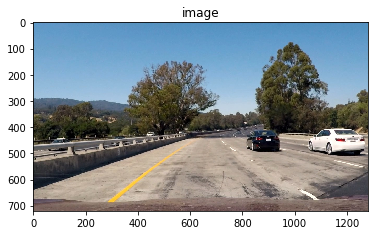
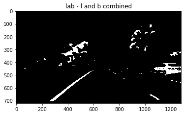
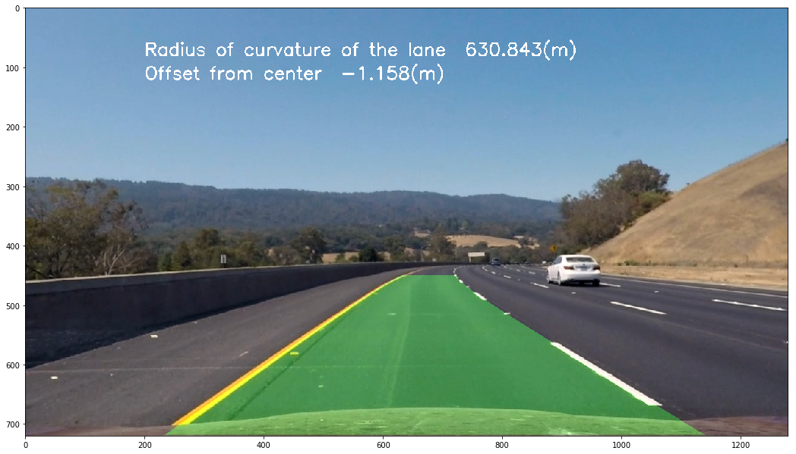
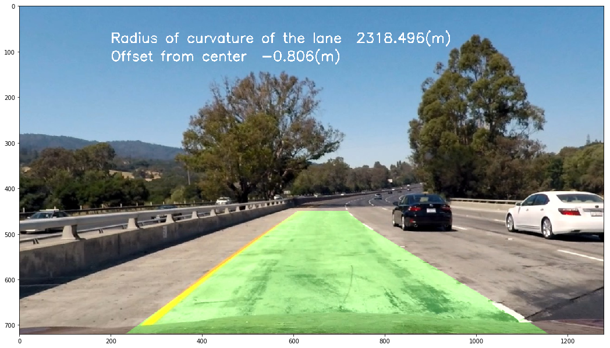

# **Advanced Lane Finding Project**

## Introduction

In this project, the goal is to write a software pipeline to identify the lane boundaries in a video from a front-facing camera on a car.

    
Click [here](https://www.youtube.com/watch?v=Yxo6a1anv2c) for the video.   


The steps of this project are the following:

* Compute the camera calibration matrix and distortion coefficients given a set of chessboard images.
* Apply a distortion correction to raw images.
* Use color transforms, gradients, etc., to create a thresholded binary image.
* Apply a perspective transform to rectify binary image ("birds-eye view").
* Detect lane pixels and fit to find the lane boundary.
* Determine the curvature of the lane and vehicle position with respect to center.
* Warp the detected lane boundaries back onto the original image.
* Output visual display of the lane boundaries and numerical estimation of lane curvature and vehicle position.

[//]: # (Image References)

[image1]: ./examples/undistort_output.png "Undistorted"
[image2]: ./test_images/test1.jpg "Road Transformed"
[image3]: ./examples/binary_combo_example.jpg "Binary Example"
[image4]: ./examples/warped_straight_lines.jpg "Warp Example"
[image5]: ./examples/color_fit_lines.jpg "Fit Visual"
[image6]: ./examples/example_output.jpg "Output"
[video1]: ./project_video.mp4 "Video"

---


## Camera Calibration

### 1. Briefly state how you computed the camera matrix and distortion coefficients.

The code for this step is contained in the second code cell of the [IPython notebook](https://github.com/jokla/CarND-Advanced-Lane-Lines/blob/master/Advanced-Lane-Lines.ipynb).

I start by preparing "object points", which will be the (x, y, z) coordinates of the chessboard corners in the world. Here I am assuming the chessboard is fixed on the (x, y) plane at z=0, such that the object points are the same for each calibration image.  Thus, `objp` is just a replicated array of coordinates, and `objpoints` will be appended with a copy of it every time I successfully detect all chessboard corners in a test image.  `imgpoints` will be appended with the (x, y) pixel position of each of the corners in the image plane with each successful chessboard detection.  

I then used the output `objpoints` and `imgpoints` to compute the camera calibration and distortion coefficients using the `cv2.calibrateCamera()` function.  I applied this distortion correction to the test image using the `cv2.undistort()` function and obtained this result:    

    

## Pipeline (single images)

### 1. An example of a distortion-corrected image.

Using the function `cv2.undistort()` and the distortion parameters calculated previously via camera calibration I apply the distortion correction on the following image:    

 

### 2. Describe how you used color transforms, gradients or other methods to create a thresholded binary image.  

I used a combination of color and gradient thresholds to generate a binary image containing likely lane pixels. 

#### Color mask

The aim of the color mask is to reveal the white and yellow lanes in the image. I tested several color spaces and finally I chose to use the 
 channel L of the [LUV color space](https://en.wikipedia.org/wiki/CIELUV) to detect the white pixels and the channels B and L of the [LAB color space](https://en.wikipedia.org/wiki/Lab_color_space) to detect the yellow/white pixels.
 
I tried out various combinations of color and gradient thresholds to generate a binary image where the lane lines are clearly visible.

Let's consider the following image:   
    

Now we convert the image to the [LUV color space](https://en.wikipedia.org/wiki/CIELUV):   
    

and we apply the threshold to get the white pixels:    

     

Now let's analyze the B and L channels of the [LAB color space](https://en.wikipedia.org/wiki/Lab_color_space):   

   

we apply the thresholds on both channels and we get:

 

we combine them:   

  

This is the result of the gradient mask:

 

obtained with the following code:
``` python

  # Convert image to HSL color and extract S channel
    hls = cv2.cvtColor(image, cv2.COLOR_RGB2HLS)
    s_channel = hls[:, :, 2]
    # Look for edges in the x direction
    gradx = abs_sobel_thresh(s_channel, orient='x', sobel_kernel=ksize, thresh=(20, 100))
    # Look for edges in the y direction
    grady = abs_sobel_thresh(s_channel, orient='y', sobel_kernel=ksize, thresh=(20, 100))
    # Compute the magnitude of the gradient and applies a threshold
    mag_binary = mag_thresh(s_channel, sobel_kernel=ksize, mag_thresh=(20, 100))
    # Masks the image based on gradient direction.
    dir_binary = dir_threshold(s_channel, sobel_kernel=ksize, thresh=(0.7, 1.3))
    #Finally we combine the previous masks
    g_combined = np.zeros_like(dir_binary)
    g_combined[((gradx == 1) & (grady == 1)) | ((mag_binary == 1) & (dir_binary == 1))] = 1

```

Finally we combine the color mask with the gradient mask:

 

I notice that the color mask is working better for the detection of the lines on the bottom part of the image while the gradient mask is working better for the line far away. That's why I decided to use both masks.
  

#### 3. Describe how  you performed a perspective transform and provide an example of a transformed image.

The code for my perspective transform is defined in the function called `perspective_transform`.  This function takes as inputs an image (`img`), as well as source (`src`) and destination (`dst`) points.  I chose the hardcode the source and destination points in the following manner:

| Source        | Destination   | 
|:-------------:|:-------------:| 
| 564, 450      | 100, 0        | 
| 716, 450      | 1180, 0       |
| -100, 720     | 100, 720      |
| 1380, 720     | 1180, 720    |


I verified that my perspective transform was working as expected by drawing the `src` and `dst` points onto a test image and its warped counterpart to verify that the lines appear parallel in the warped image.

![alt text][image4]

Here some examples of the transformation applied to test images: 
   
   
   

The perspective transformation allow us to create a "birds-eye view" that will be useful to identify the lanes.


#### 4. Describe how you identified lane-line pixels and fit their positions with a polynomial.

After correcting the distortion, applying thresholding, and applying a perspective transform to a road image, we have a binary image where the lane lines stand out clearly. However, we still need to decide explicitly which pixels are part of the lines and which belong to the left line and which belong to the right line.

 

I first take a histogram along all the columns in the lower half of the image like this:

```python
import numpy as np
histogram = np.sum(img[img.shape[0]//2:,:], axis=0)
plt.plot(histogram)
```

This is the result:

   

The peaks in the histogram represent the position of each lines in the bottom part of the image.  I can use that as a starting point for where to search for the lines. From that point, I can use a sliding window, placed around the line centers, to find and follow the lines up to the top of the frame. Now we can fit a second order polynomial to each group of points, get the curve equations and plot them:

   


#### 5. Describe how you calculated the radius of curvature of the lane and the position of the vehicle with respect to center.


Here the idea is to take the measurements of where the lane lines are and estimate how much the road is curving and where the vehicle is located with respect to the center of the lane. The radius of curvature is given in meters assuming the curve of the road follows a circle. For the position of the vehicle, we assume that the camera is mounted at the center of the car and the deviation of the midpoint of the lane from the center of the image is the offset. You can find the function computing radius and offset under the name `compute_radius_offset`. I used [this tutorial](http://www.intmath.com/applications-differentiation/8-radius-curvature.php) to compute the radius. The final radius of curvature was taken by average the left and right curve radius. The vehicle position is calculated as the difference between the image center and the lane center.


#### 6. Provide an example image of your result plotted back down onto the road such that the lane area is identified clearly.

Here is an example of my result on a test image:

 

Now others examples:
---
    
    
   
---
    
    
     
---
    
    
    

---

### Pipeline (video)

   
Click [here](https://www.youtube.com/watch?v=Yxo6a1anv2c) for the video.

The pipeline for the video is similar to that one described above for the image. Since we are working with a video stream, we can take advantage of the previous detection. I defined a `Line()` class to keep track of all the interesting parameters measured from frame to frame.

At the first iteration, we don't know at all where the lines are, so we used the sliding window technique described before. In the next frame of video we don't need to do a blind search again, but instead we can just search in a margin around the previous line position (the green shaded area in the video). If the tracking fails (i.e. the line is not found), then we go back to the sliding windows search to look again for the lines. This is working independently for the right and left lines.

In addition I added a sanity check: I compute the intersections of the curves with the  axes `x=0` (top of the image and compute the distance between the two points. I repeated the computation with the axes `x=height` (bottom of the image). If the two distances are similar it means that they are roughly parallel and have a similar curvature, otherwise the actual detection is considered not good and discarded in place of the previous detection.
 
Moreover, I used a deque collection type to store the last n frames of video, and compute the mean to obtain a cleaner result.

---

### Discussion

The pipeline is working quite well on the test video but more effort is needed to have a more general solution.

This approach could not work properly:
* if the camera is placed at a different position
* if other vehicles in front are occluding the view
* if one or more line lanes are missing
* at urban scenario
* at different weather and light condition (fog, rain, or at night)

It would be interesting to test a deep learning approach for the segmentation of the road, as [SegNet](http://mi.eng.cam.ac.uk/projects/segnet/#research), a deep encoder-decoder architecture for multi-class pixelwise segmentation:

[](https://www.youtube.com/watch?v=CxanE_W46ts)

